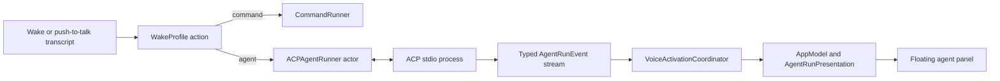

# ACP agent harness

Voice Activation can route a completed spoken command either to the existing
direct command target or to a local coding agent through Agent Client Protocol
(ACP) version 1. An agent request opens a live, voice-driven conversation that
streams observable work into a floating macOS panel while the foreground
application keeps keyboard focus.

This document defines the first supported agent-harness contract. ACP version
2 is experimental and is deliberately out of scope.

## Product contract

Every wake profile keeps its wake phrase, accent, enabled state, and optional
push-to-talk shortcut. Its run target is one of:

- **Command:** the current absolute executable plus argument templates. At
  least one argument contains `{text}` or `{urlText}`. The executable is
  launched directly without a shell.
- **Agent harness:** an ACP v1 executable, argument vector, working directory,
  provider preset, and permission policy. The recognized command is sent as a
  text block in `session/prompt`; it is never interpolated into a shell command.

Existing saved profiles have no target discriminator. They decode as command
targets without changing their UUID, phrase, accent, enabled state, shortcut,
executable, or argument templates. A failed decode never overwrites the stored
profile data with a default profile.

Settings offer four agent presets:

| Preset | ACP launch command |
| --- | --- |
| Cursor | `cursor-agent acp` |
| Codex | `npx -y @agentclientprotocol/codex-acp@1.8.0` |
| Claude | `npx -y @agentclientprotocol/claude-agent-acp@0.73.0` |
| Custom | User-supplied absolute executable and argument vector |

The adapter versions are pinned so a working profile cannot silently acquire a
breaking protocol change. Selecting a preset fills editable launch fields. When
an empty Agent target is opened for the first time, settings choose the first
locally available preset, preferring Cursor before the `npx`-based adapters.
The executable detector checks the app process's inherited `PATH`, then common
Homebrew, `/usr/local`, `~/.local/bin`, ChatGPT application-resource, and
installed NVM node-version directories. Settings identify whether discovery
came from `PATH`, a known location, NVM, or a directly selected file. Custom
targets may enter a bare command name and resolve it with **Detect**, or choose
a file using the native picker.

The persisted absolute executable path remains authoritative because a Finder-
or login-item-launched application cannot rely on an interactive shell's
`PATH`. Reopening settings never replaces a saved path or edited adapter
arguments automatically.

The app inherits the launch environment but never stores API keys or other
secret values in preferences. Users authenticate the selected agent through
its normal provider CLI before starting a run.

## Runtime architecture

`VoiceActivationCoordinator` remains main-actor isolated and owns speech state,
capture timing, and execution generations. It pins the matched profile action
when capture begins. A command action follows the current one-shot path. An
agent action calls an injected `AgentHarnessRunning` boundary and publishes
typed run events separately from `ActivationState`.

`ACPAgentRunner` is an actor. It owns provider connections, serialized writes,
request identifiers, pending JSON-RPC continuations, permission decisions, and
process termination. It keeps one initialized ACP process and session per
profile while configuration remains unchanged. A conversation sends multiple
sequential prompt turns through that same ACP session, preserving the agent's
context. Only one prompt turn may be active globally. A spoken follow-up during
an active turn first cancels that turn, then starts the follow-up after ACP has
settled cancellation; additional utterances remain ordered.

The process transport disables `SIGPIPE` for child stdin, uses nonblocking
writes, closes the parent write side during termination, drains stdout and
stderr independently, and marks an exited process unavailable immediately. It
keeps current-generation delivery alive for a bounded drain grace so final
updates are not truncated, then closes inherited pipe handles and fails any
pending request. A short post-response settle window catches cross-pipe
diagnostics that arrive with process exit. Stderr is decoded incrementally and
coalesced within its 16 KiB bound before UI delivery.

All events and completions carry the coordinator's execution generation. A
cancelled, replaced, or shut-down run cannot mutate the current UI even if an
old process emits late data.

## ACP v1 wire contract

ACP subprocess communication follows the stable protocol-owner specification:

- UTF-8 JSON-RPC 2.0 over standard input and standard output.
- Exactly one compact JSON value per line; protocol messages contain no
  embedded literal newline bytes.
- Incoming request identifiers preserve the full ACP `int64 | string | null`
  union so permission responses use exactly the identifier sent by the agent.
- Standard error is a separate diagnostic stream and never parsed as ACP.
- Startup calls `initialize` with `protocolVersion: 1`, no filesystem,
  terminal, terminal-authentication, or elicitation capabilities, and Voice
  Activation implementation metadata.
- Session creation uses the provider's ambient CLI authentication. If it
  returns `auth_required`, the connection closes cleanly and the app displays
  the advertised method names with provider CLI login guidance. Voice
  Activation neither guesses among multiple methods nor emulates an interactive
  terminal.
- A fresh `session/new` uses the profile's absolute working directory and an
  empty MCP server list.
- Each initial request and follow-up utterance becomes one `session/prompt` in
  the same profile session, containing a harness instruction
  text block followed by the untouched recognized request. The instruction asks
  for user-facing GitHub-flavored Markdown; ACP v1 has no separate system-role
  field.
- `session/update` streams until the prompt response supplies a stop reason.

The client handles every stable ACP v1 update discriminator:

- user and agent message chunks;
- agent thought chunks exposed by the provider;
- tool calls and tool-call updates;
- complete plan replacements;
- available commands, mode, configuration, and session metadata updates;
- usage updates.

Unknown update types and provider extensions do not crash or end the run. They
appear as bounded diagnostics. Unknown inbound requests receive JSON-RPC
`method not found`; Cursor's blocking question and plan-approval extensions
receive their documented cancelled result and are reported rather than left
pending.

The client does not claim to expose private chain-of-thought. It displays only
content the agent sends through ACP.

## Permission handling

An agent profile has one of three permission policies:

- **Ask:** show the ACP tool description and the agent-provided choices in the
  run panel. Work remains paused until the user chooses or cancels.
- **Allow once:** automatically select an `allow_once` option, falling back to
  `allow_always` only when the agent offers no one-shot choice.
- **Reject:** select a one-shot rejection when available, otherwise return a
  cancelled outcome.

The panel displays agent-provided choice labels; it does not invent an approval
the agent did not offer. Selecting any choice collapses that request immediately
and resolves it exactly once. Cancelling a run resolves every pending permission
as cancelled before the process is torn down. Each displayed choice carries a
globally unique opaque turn identifier as well as the wire request ID, so a
delayed click cannot resolve a reused request ID from a later turn or replacement
connection.

## Streaming presentation

Agent execution uses a separate borderless `NSPanel` at floating level. It
joins full-screen spaces, stays above the active application, and never becomes
the key window. Pointer controls work without moving keyboard focus away from
the user's current application.

The panel opens at the recording overlay's bottom-centred screen and animates
to a 620 by 420 point material surface. It contains:

- provider, running phase, elapsed time, and profile accent;
- the immutable spoken request;
- a live, selectable Markdown timeline that preserves the wire order of agent
  text and tool activity;
- compact tool rows with a top-aligned animated activity indicator while
  running and expandable details after completion;
- permission choices when required;
- a live microphone row that shows the current follow-up transcription;
- **Stop turn** while running and **End conversation** throughout the live
  conversation, then **Close** and **Copy output** after it ends;
  and
- explicit truncation notices when a safety limit is reached.

The transcript auto-follows output, tool, permission, and voice-input growth
only while the view is already pinned near the bottom. A deliberate user scroll
up disables following; returning to the bottom enables it again. Programmatic
scrolling and content growth never misclassify that state.

Completing one turn keeps the microphone and conversation open for a follow-up.
Ending the conversation leaves the panel visible for inspection. The menu-bar
panel offers **Show conversation**, **Stop turn**, and **End conversation** while
applicable. A new conversation reuses the panel and clears the prior in-memory
presentation.

Token bursts publish on leading and trailing edges at a fixed 50-millisecond
cadence. This preserves immediate feedback without making SwiftUI render once
per token. Adjacent chunks coalesce only within their current timeline message;
a tool call ends that block, so later prose renders below the tool. Plans replace
atomically, tool updates retain their original timeline identity, simultaneous
permissions remain independently actionable, and app-authored truncation or
protocol notices cannot be mistaken for provider output.

Direct command profiles keep the current short execution state and do not open
the agent panel.

## Live voice, audio, cancellation, and recovery

After the first request, a dedicated conversation recognition session remains
active both while the agent works and while it waits for the next turn. A normal
utterance is appended to the ordered timeline and sent as a follow-up. The
profile's push-to-talk shortcut also contributes a follow-up while that
conversation is open rather than creating a second agent session.

Saying only `cancel`, `stop`, or `dismiss` cancels the active turn while keeping
the conversation available. Saying one of those words while no turn is running
ends the conversation. The same command during spoken reply playback stops the
playback and ends the idle conversation. Agent speech is excluded from normal
follow-up recognition so the synthesizer cannot talk to itself.

**Stop turn** transitions the turn to `cancelling` immediately,
invalidate its execution generation, respond to pending permissions with a
cancelled outcome, and send `session/cancel` for the active session. The client
waits up to two seconds for the prompt to finish with `stopReason: cancelled`.
Any other post-cancel stop reason invalidates the connection. The runner then
terminates an unresponsive process and discards that cached connection.

**End conversation** cancels an active turn when necessary, closes live
conversation recognition, and resumes passive wake listening after the normal
cooldown.

Settings independently enable spoken agent replies and a quiet working pulse.
Reply speech uses the selected locale's macOS system voice and strips Markdown
formatting; fenced code is announced but not read character by character. The
working pulse begins only after a 1.6-second pause and repeats every 3.2 seconds
while the agent is thinking or using tools. It stops for permission choices,
cancellation, completion, and failure. Every streamed
response or tool update resets the initial delay, so the cue marks silence
rather than competing with active output.

Application shutdown cancels the active turn and terminates every cached ACP
process. Saving changed agent configuration discards the affected cached
connection. Disabling passive wake listening does not kill an already-running
agent; the explicit agent cancellation actions own that decision.

Malformed JSON, oversized frames, incompatible protocol versions, unexpected
EOF, non-zero process termination, and JSON-RPC errors become user-safe failed
run states with bounded diagnostics. A failed connection is never reused.

## Resource and privacy bounds

- A prompt is rejected above 8 KiB of UTF-8 rather than silently truncated.
- One ACP line is limited to 1 MiB before the connection is failed.
- Accepted events waiting between transport ingestion and consumer callbacks
  retain at most 512 KiB of output, 16 KiB of diagnostics, 512 KiB of control
  data, 256 control entries, and 32 pending permissions. Output and diagnostics
  discard their oldest UTF-8-safe content with typed notices; control or
  permission overflow fails the run explicitly.
- Copyable response output retains at most 512 KiB of UTF-8. The rendered
  timeline retains at most 64 KiB and 256 visible activity items, with an
  explicit marker when older activity is omitted.
- Standard-error diagnostics retain the newest 16 KiB.
- The presentation retains the latest 32 tool calls; older completed calls are
  summarized by count.
- UI publication is coalesced to at most 20 updates per second during token
  bursts.
- The 1 MiB frame limit bounds parser input; decoding one accepted frame may
  transiently allocate its JSON representation before typed delivery applies
  the retained-queue limits above.
- No audio, prompt history, run history, raw tool payload, or agent output is
  written to disk by Voice Activation.

Natural prompt completion drains both bounded delivery stages before publishing
success. Forced cancellation and shutdown invalidate the active turn before
discarding queued delivery, so callback re-entry or a suspended completion
cannot publish stale success. At most the callback already in flight may finish
after forced discard, and every UI boundary rejects it by run identifier.

## Verification contract

Tests use deterministic fake transports and runners; CI never calls a paid
model or depends on installed agent CLIs.

- Profile tests cover legacy decoding, new target round trips, validation, and
  preservation of profile identity and shortcuts.
- The NDJSON framer is tested at every input split point, including multibyte
  UTF-8, malformed data, and size limits.
- ACP client tests cover initialize, authentication, session creation, all
  update types, permission responses, unknown messages, JSON-RPC errors,
  cancellation, EOF, and stale responses.
- Process tests prove direct argv launch, separate stdout/stderr draining, and
  bounded cancellation escalation.
- Coordinator tests prove routing, same-session follow-ups, voice interruption,
  ordered streaming, generation isolation, explicit cancellation, shutdown,
  and exactly-once passive restart.
- App tests prove draft round trips, preset resolution, bounded presentation,
  bottom-pinned scrolling policy, silent injected audio behavior, panel actions,
  menu affordances, and nonactivating window configuration.

The complete change must pass the normal Swift test suite, warnings-as-errors
build, Thread Sanitizer, app packaging, property-list validation, code-sign
verification, and the exact pushed commit's CI workflow.

## Primary references

- [ACP v1 overview](https://agentclientprotocol.com/protocol/overview)
- [ACP stdio transport](https://agentclientprotocol.com/protocol/transports)
- [ACP prompt lifecycle](https://agentclientprotocol.com/protocol/prompt-turn)
- [ACP tool permissions](https://agentclientprotocol.com/protocol/tool-calls)
- [Cursor native ACP server](https://prod.cursor.com/docs/cli/acp)
- [Codex ACP adapter](https://github.com/agentclientprotocol/codex-acp)
- [Claude ACP adapter](https://github.com/agentclientprotocol/claude-agent-acp)
