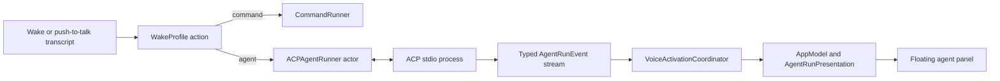

# ACP agent harness

Voice Activation can route a completed spoken command either to the existing
direct command target or to a local coding agent through Agent Client Protocol
(ACP) version 1. Agent targets stream their observable work into a floating
macOS panel while the foreground application keeps keyboard focus.

This document defines the first supported agent-harness contract. ACP version
2 is experimental and is deliberately out of scope.

## Product contract

Every wake profile keeps its wake phrase, accent, enabled state, and optional
push-to-talk shortcut. Its run target is one of:

- **Command:** the current absolute executable plus argument templates. At
  least one argument contains `{text}` or `{urlText}`. The executable is
  launched directly without a shell.
- **Agent harness:** an ACP v1 executable, argument vector, working directory,
  provider preset, and permission policy. The recognized command is sent as a
  text block in `session/prompt`; it is never interpolated into a shell command.

Existing saved profiles have no target discriminator. They decode as command
targets without changing their UUID, phrase, accent, enabled state, shortcut,
executable, or argument templates. A failed decode never overwrites the stored
profile data with a default profile.

Settings offer four agent presets:

| Preset | ACP launch command |
| --- | --- |
| Cursor | `cursor-agent acp` |
| Codex | `npx -y @agentclientprotocol/codex-acp@1.8.0` |
| Claude | `npx -y @agentclientprotocol/claude-agent-acp@0.73.0` |
| Custom | User-supplied absolute executable and argument vector |

The adapter versions are pinned so a working profile cannot silently acquire a
breaking protocol change. Selecting a preset fills editable launch fields. The
persisted absolute executable path remains authoritative because a Finder-
launched application cannot rely on an interactive shell's `PATH`.

The app inherits the launch environment but never stores API keys or other
secret values in preferences. Users authenticate the selected agent through
its normal provider CLI before starting a run.

## Runtime architecture

`VoiceActivationCoordinator` remains main-actor isolated and owns speech state,
capture timing, and execution generations. It pins the matched profile action
when capture begins. A command action follows the current one-shot path. An
agent action calls an injected `AgentHarnessRunning` boundary and publishes
typed run events separately from `ActivationState`.

`ACPAgentRunner` is an actor. It owns provider connections, serialized writes,
request identifiers, pending JSON-RPC continuations, permission decisions, and
process termination. It keeps one initialized ACP process and session per
profile while configuration remains unchanged. Only one prompt turn may be
active globally. A later phrase does not queue silently behind a running agent.

All events and completions carry the coordinator's execution generation. A
cancelled, replaced, or shut-down run cannot mutate the current UI even if an
old process emits late data.

## ACP v1 wire contract

ACP subprocess communication follows the stable protocol-owner specification:

- UTF-8 JSON-RPC 2.0 over standard input and standard output.
- Exactly one compact JSON value per line; protocol messages contain no
  embedded literal newline bytes.
- Incoming request identifiers preserve the full ACP `int64 | string | null`
  union so permission responses use exactly the identifier sent by the agent.
- Standard error is a separate diagnostic stream and never parsed as ACP.
- Startup calls `initialize` with `protocolVersion: 1`, no filesystem,
  terminal, terminal-authentication, or elicitation capabilities, and Voice
  Activation implementation metadata.
- Session creation uses the provider's ambient CLI authentication. If it
  returns `auth_required`, the connection closes cleanly and the app displays
  the advertised method names with provider CLI login guidance. Voice
  Activation neither guesses among multiple methods nor emulates an interactive
  terminal.
- A fresh `session/new` uses the profile's absolute working directory and an
  empty MCP server list.
- Each utterance becomes one `session/prompt` containing one text content
  block.
- `session/update` streams until the prompt response supplies a stop reason.

The client handles every stable ACP v1 update discriminator:

- user and agent message chunks;
- agent thought chunks exposed by the provider;
- tool calls and tool-call updates;
- complete plan replacements;
- available commands, mode, configuration, and session metadata updates;
- usage updates.

Unknown update types and provider extensions do not crash or end the run. They
appear as bounded diagnostics. Unknown inbound requests receive JSON-RPC
`method not found`; blocking Cursor extensions that ask a question are
explicitly cancelled and reported rather than left pending.

The client does not claim to expose private chain-of-thought. It displays only
content the agent sends through ACP.

## Permission handling

An agent profile has one of three permission policies:

- **Ask:** show the ACP tool description and the agent-provided choices in the
  run panel. Work remains paused until the user chooses or cancels.
- **Allow once:** automatically select an `allow_once` option, falling back to
  `allow_always` only when the agent offers no one-shot choice.
- **Reject:** select a one-shot rejection when available, otherwise return a
  cancelled outcome.

The panel displays agent-provided choice labels; it does not invent an approval
the agent did not offer. Cancelling a run resolves every pending permission as
cancelled before the process is torn down.

## Streaming presentation

Agent execution uses a separate borderless `NSPanel` at floating level. It
joins full-screen spaces, stays above the active application, and never becomes
the key window. Pointer controls work without moving keyboard focus away from
the user's current application.

The panel opens at the recording overlay's bottom-centred screen and animates
to a 620 by 420 point material surface. It contains:

- provider, running phase, elapsed time, and profile accent;
- the immutable spoken request;
- a live, selectable event transcript covering agent text, plans, tools,
  diagnostics, and terminal state;
- permission choices when required;
- **Cancel** while running, then **Close** and **Copy output** after completion;
  and
- explicit truncation notices when a safety limit is reached.

The transcript auto-follows new output until the user scrolls away from the
bottom. Completion leaves the panel visible for inspection. The menu-bar panel
offers **Show agent run** and **Cancel agent run** while applicable. A new run
reuses the panel and clears the prior in-memory presentation.

Direct command profiles keep the current short execution state and do not open
the agent panel.

## Cancellation and recovery

Panel and menu cancellation transition the run to `cancelling` immediately,
invalidate its execution generation, respond to pending permissions with a
cancelled outcome, and send `session/cancel` for the active session. The client
waits up to two seconds for the prompt to finish with `stopReason: cancelled`.
It then terminates an unresponsive process and discards that cached connection.

Application shutdown cancels the active turn and terminates every cached ACP
process. Saving changed agent configuration discards the affected cached
connection. Disabling passive wake listening does not kill an already-running
agent; the explicit agent cancellation actions own that decision.

Malformed JSON, oversized frames, incompatible protocol versions, unexpected
EOF, non-zero process termination, and JSON-RPC errors become user-safe failed
run states with bounded diagnostics. A failed connection is never reused.

## Resource and privacy bounds

- A prompt is rejected above 8 KiB of UTF-8 rather than silently truncated.
- One ACP line is limited to 1 MiB before the connection is failed.
- The visible event transcript retains at most 512 KiB of UTF-8 for the current
  run and marks discarded oldest output.
- Standard-error diagnostics retain the newest 16 KiB.
- The presentation retains the latest 32 tool calls; older completed calls are
  summarized by count.
- UI publication is coalesced to at most 20 updates per second during token
  bursts.
- No audio, prompt history, run history, raw tool payload, or agent output is
  written to disk by Voice Activation.

## Verification contract

Tests use deterministic fake transports and runners; CI never calls a paid
model or depends on installed agent CLIs.

- Profile tests cover legacy decoding, new target round trips, validation, and
  preservation of profile identity and shortcuts.
- The NDJSON framer is tested at every input split point, including multibyte
  UTF-8, malformed data, and size limits.
- ACP client tests cover initialize, authentication, session creation, all
  update types, permission responses, unknown messages, JSON-RPC errors,
  cancellation, EOF, and stale responses.
- Process tests prove direct argv launch, separate stdout/stderr draining, and
  bounded cancellation escalation.
- Coordinator tests prove routing, ordered streaming, generation isolation,
  explicit cancellation, shutdown, and exactly-once passive restart.
- App tests prove draft round trips, preset resolution, bounded presentation,
  panel actions, menu affordances, and nonactivating window configuration.

The complete change must pass the normal Swift test suite, warnings-as-errors
build, Thread Sanitizer, app packaging, property-list validation, code-sign
verification, and the exact pushed commit's CI workflow.

## Primary references

- [ACP v1 overview](https://agentclientprotocol.com/protocol/overview)
- [ACP stdio transport](https://agentclientprotocol.com/protocol/transports)
- [ACP prompt lifecycle](https://agentclientprotocol.com/protocol/prompt-turn)
- [ACP tool permissions](https://agentclientprotocol.com/protocol/tool-calls)
- [Cursor native ACP server](https://prod.cursor.com/docs/cli/acp)
- [Codex ACP adapter](https://github.com/agentclientprotocol/codex-acp)
- [Claude ACP adapter](https://github.com/agentclientprotocol/claude-agent-acp)
