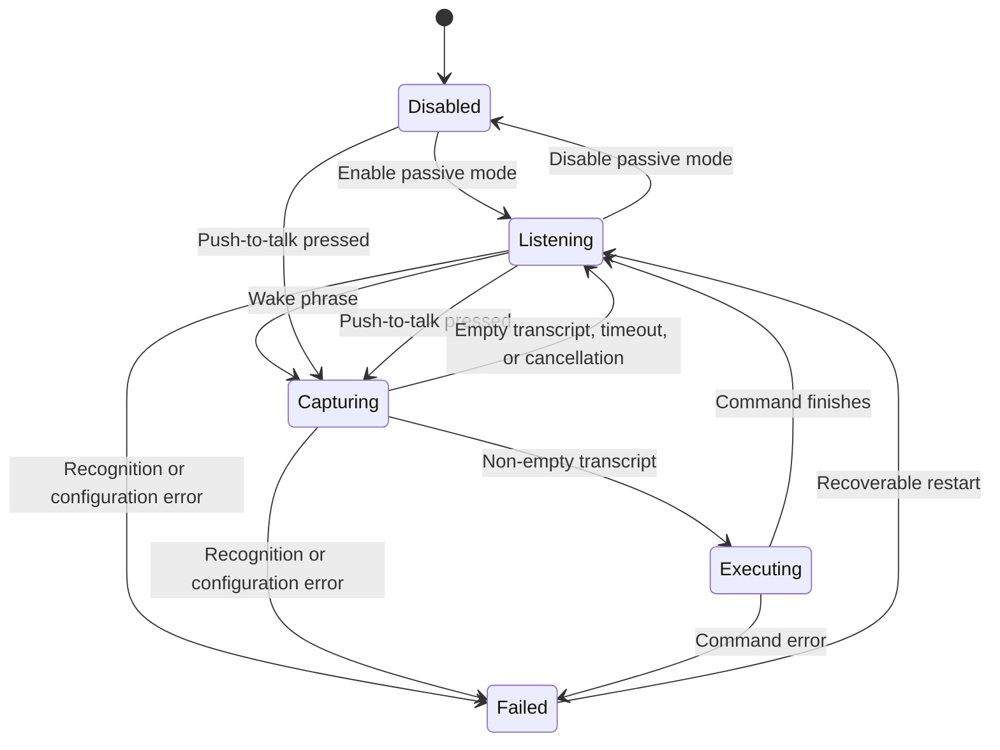

# Architecture

Voice Activation separates testable speech and command behavior from macOS UI
and framework adapters.

## Modules

- `VoiceActivationCore` owns wake matching, state transitions, command
  templates, process execution, and preferences.
- `VoiceActivationApp` owns the SwiftUI menu and Settings window, Apple speech
  capture, privacy requests, Carbon global shortcut, and Service Management
  login-item registration. It also owns the non-activating recording overlay.
- `VoiceActivationCoreTests` covers pure coordinator, matcher, template,
  runner, and preference behavior.
- `VoiceActivationAppTests` covers macOS adapter policies, audio callback
  isolation, menu status, and Settings presentation.

`AppModel` is the main-actor bridge between SwiftUI and
`VoiceActivationCoordinator`. The coordinator owns exactly one active speech
session and invalidates callbacks from retired sessions with a generation
identifier. It publishes the current command transcription separately from the
last command so UI can show partial words without changing command history.

## State flow

The visible menu-bar state is `Disabled`, `Listening`, `Capturing`, `Running
command`, or an error message.

## Speech modes

- **Passive wake:** the always-listen toggle starts on-device recognition. It
  restarts after final results and recoverable failures.
- **Command capture:** a wake phrase finalized alone starts recognition that
  may use Apple's speech service. It finishes after 5 seconds without initial
  command text, on a final result, after 1.5 seconds of inactivity following
  text, or at the 30-second absolute maximum.
- **Push to talk:** Control-Option-Space starts recognition that may use Apple's
  speech service. Releasing the shortcut finishes capture.

When the wake phrase and command arrive in one transcription, the coordinator
uses the remaining text immediately. When the wake phrase is recognized alone,
it starts a dedicated command session so pausing after `computer` does not
discard the next utterance. A partial result containing only the wake phrase
schedules that session after a short grace period instead of waiting for Apple
to close the wake utterance. Command words arriving during the grace period
cancel the handoff and continue through the existing passive result.

The coordinator recognizes `cancel`, `stop`, and `dismiss` as cancellation
words. A lone word cancels only at a completion boundary so a partial `stop`
can still grow into `stop the music`. Two adjacent copies of the same word
cancel immediately in passive command capture or push-to-talk.

## Command execution

`CommandTemplate` validates two invariants before settings are saved:

1. The executable path is absolute.
2. At least one argument contains `{text}` or `{urlText}`.

`CommandRunner` verifies that the file is executable, expands each argument,
starts `Foundation.Process`, discards process standard streams, and treats a
non-zero exit status as an error. No shell parses the transcript.

## Concurrency and lifecycle

- Coordinator and app-model mutation is isolated to the main actor.
- The real-time audio tap appends buffers through a sendable sink without
  crossing into main-actor state.
- Mode changes cancel inactivity and maximum-duration tasks, stop the audio
  engine, remove its input tap, and cancel the recognition task.
- Recognition callbacks carry a session generation and are ignored after that
  session is stopped.
- A bare partial wake phrase schedules a command-capture handoff after a short
  grace period. Same-utterance command text cancels it; late final callbacks
  from a retired wake session are ignored.
- Empty final recognition results restart the command recognizer within the
  existing capture window; they do not reset its initial-silence or absolute
  deadlines.
- Command execution runs asynchronously and returns to passive listening after
  a short cooldown.
- `LaunchAtLoginSetting` reads and changes `SMAppService.mainApp` registration;
  macOS remains the source of truth instead of a duplicated preference.
- `RecordingOverlayPresenter` maps capture state to a
  `RecordingOverlayController`. Its borderless `NSPanel` joins full-screen
  spaces, does not activate the app, and follows the screen containing the
  pointer. The panel frame matches the visible surface exactly and animates
  between bottom-centered compact and expanded geometry. A single retained
  SwiftUI hierarchy interpolates the microphone, capsule, transcript, and
  cancel control instead of swapping complete views. The panel accepts pointer
  input only so its cancel control can abort capture.

## Privacy boundary

Passive wake recognition sets `requiresOnDeviceRecognition` and refuses to run
when the locale lacks on-device support. Interactive command capture can use
Apple's speech service. Audio is not stored. Partial text exists in memory only
during the current capture; the most recent submitted command remains for menu
feedback.

Next: [development and verification](development.md).
