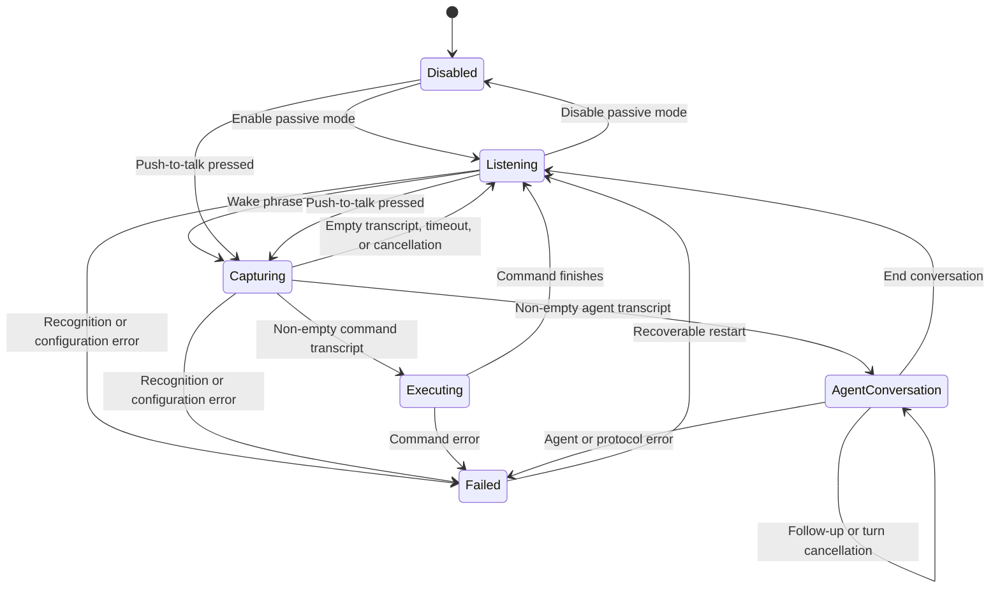

# Architecture

Voice Activation separates testable speech, direct-command, and ACP-agent
behavior from macOS UI and framework adapters.

## Modules

- `VoiceActivationCore` owns wake matching, state transitions, command
  templates, ACP framing and lifecycle, bounded event delivery, process
  execution, and preferences.
- `VoiceActivationApp` owns the SwiftUI menu and Settings window, Apple speech
  capture, privacy requests, Carbon global shortcuts, and Service Management
  login-item registration. It also owns the non-activating recording overlay
  and streamed agent panel.
- `MenuContentView` renders the menu-bar extra as a material-backed control
  panel with state-specific status presentation, compact profile controls,
  inline shortcut hints, capture cancellation, and application actions.
- `VoiceActivationCoreTests` covers pure coordinator, matcher, template,
  runner, and preference behavior.
- `VoiceActivationAppTests` covers macOS adapter policies, audio callback
  isolation, menu status, and Settings presentation.

`AppModel` is the main-actor bridge between SwiftUI and
`VoiceActivationCoordinator`. The coordinator owns exactly one active speech
session and invalidates callbacks from retired sessions with a generation
identifier. Executions have an independent generation so an older command or
agent callback cannot overwrite a newer capture or execution. It carries
the matched `WakeProfile` through capture before publishing capture state, so
command routing and overlay color cannot drift apart, and publishes current
command text separately from command history.

`WakeProfileCollectionValidator` owns cross-profile invariants. It shares wake
phrase canonicalization with `WakePhraseMatcher`, preventing two visually
different phrases from competing for the same recognized trigger, and rejects
duplicate push-to-talk bindings before adapters mutate system registration.

## State flow

The visible menu-bar state is `Disabled`, `Listening`, `Capturing`, `Running
command`, `Running agent`, or an error message. Agent presentation is separate
from speech state. A completed turn therefore changes the panel to its listening
phase without discarding output or the live conversation; the final panel stays
visible after the conversation returns to passive wake listening.

## Speech modes

- **Passive wake:** the always-listen toggle starts on-device recognition. It
  supplies only individually enabled profiles as contextual vocabulary and
  matching candidates, then restarts after final results and recoverable failures.
- **Command capture:** a wake phrase finalized alone starts recognition that
  may use Apple's speech service. It finishes after 5 seconds without initial
  command text, on a final result, after 1.5 seconds of inactivity following
  text, or at the 30-second absolute maximum.
- **Push to talk:** each profile may persist a distinct Carbon global hotkey that
  starts recognition for that profile and may use Apple's speech service.
  Releasing the shortcut finishes capture. Settings records AppKit key events
  into profile drafts and registers the full binding set only when settings are
  saved.
  The prior registration remains active until that save succeeds and is restored
  if the requested combination is unavailable.
- **Agent conversation:** after an agent request, interactive recognition stays
  active without an initial-silence timeout. Final speech or 1.5 seconds of
  inactivity submits a follow-up, and the 30-second utterance bound still
  applies. Push-to-talk becomes another input method for the open conversation.

When a wake phrase and command arrive in one transcription, the coordinator
uses the remaining text immediately. When the wake phrase is recognized alone,
it starts a dedicated command session so pausing after `computer` does not
discard the next utterance. A partial result containing only the wake phrase
schedules that session after a short grace period instead of waiting for Apple
to close the wake utterance. Command words arriving during the grace period
cancel the handoff and continue through the existing passive result.

The coordinator recognizes `cancel`, `stop`, and `dismiss` as cancellation
words. A lone word cancels only at a completion boundary so a partial `stop`
can still grow into `stop the music`. Two adjacent copies of the same word
cancel immediately in passive command capture or push-to-talk.

`WakePhraseMatcher` checks every enabled profile and chooses the longest matching
phrase. The profile owns its command or agent action, accent color, and optional
push-to-talk binding. A shortcut event identifies its profile before capture
begins, so wake and push-to-talk execute the same pinned profile action.
Passive recognition supplies every enabled phrase to Apple Speech as contextual
vocabulary so uncommon names and intentional spellings are not treated as
ordinary dictation.

## Command execution

Each profile constructs a `CommandTemplate` that validates two invariants before
settings are saved:

1. The executable path is absolute.
2. At least one argument contains `{text}` or `{urlText}`.

`CommandRunner` verifies that the file is executable, expands each argument,
starts `Foundation.Process`, discards process standard streams, and treats a
non-zero exit status as an error. No shell parses the transcript.

## Agent execution

`ACPAgentRunner` is an actor that caches one initialized process and ACP session
per unchanged profile configuration. `ACPClientConnection` owns JSON-RPC request
identity, prompt settlement, permissions, cancellation, and exact terminal
state. `ACPProcessTransport` owns direct-argument launch and independent
nonblocking stdin, stdout, and stderr lifecycles.

The client accepts ACP v1 newline-delimited UTF-8 JSON-RPC, preserves integer,
string, and null request identifiers, and converts stable updates into typed
`AgentRunEvent` values. A two-stage bounded delivery path separates transport
ingestion from consumer callbacks so a slow panel cannot grow memory without
limit. Natural completion drains accepted events; forced cancellation invalidates
the turn first and discards queued delivery.

`AgentRunPresentation` applies only events carrying the active run identifier,
retains bounded output, diagnostics, tools, plans, and simultaneous permission
requests, and reduces visible text and tool events into one ordered timeline.
Tool updates mutate the original timeline item; a later message therefore stays
after the tool that preceded it. Token bursts publish to SwiftUI at no more than
20 updates per second. `AgentRunPanelController` hosts the Markdown renderer and
expandable activity model in a non-activating floating `NSPanel`; the recording
overlay passes its exact final frame into the initial panel morph.

One presentation run identifier spans the whole conversation. User follow-ups,
agent messages, and tools share one chronological timeline while individual ACP
turns remain sequential. The panel's bottom-follow policy changes only on
user-driven scrolling; output growth and animated programmatic scrolling cannot
disable it.

`AgentConversationAudioPresenter` observes typed lifecycle events through an
injected playback boundary. It collects only user-facing agent message deltas,
converts their Markdown to speech text at turn completion, and independently
controls the delayed working pulse. Tests inject a silent player. The system
adapter uses `AVSpeechSynthesizer` and a low-volume bundled cue.

See [ACP agent harness](agent-harness.md) for the complete wire, permission,
resource, and recovery contract.

## Concurrency and lifecycle

- Coordinator and app-model mutation is isolated to the main actor.
- The real-time audio tap appends buffers through a sendable sink without
  crossing into main-actor state.
- Mode changes cancel inactivity and maximum-duration tasks, stop the audio
  engine, remove its input tap, and cancel the recognition task.
- Recognition callbacks carry a session generation and are ignored after that
  session is stopped.
- A bare partial wake phrase schedules a command-capture handoff after a short
  grace period. Same-utterance command text cancels it; late final callbacks
  from a retired wake session are ignored.
- Empty final recognition results restart the command recognizer within the
  existing capture window; they do not reset its initial-silence or absolute
  deadlines.
- Command execution runs asynchronously and returns to passive listening after
  a short cooldown.
- Agent turns remain independently cancellable while their conversation speech
  session continues. Explicitly ending the conversation resumes passive
  listening. Stale events are rejected by execution generation and conversation
  run identifier at the coordinator, app model, and presentation boundaries.
- During synthesized reply playback, conversation recognition ignores ordinary
  speech to prevent output echo from becoming a prompt. Cancellation words stop
  playback and close an idle conversation; recognition restarts cleanly after
  speech ends.
- `LaunchAtLoginSetting` reads and changes `SMAppService.mainApp` registration;
  macOS remains the source of truth instead of a duplicated preference.
- `RecordingOverlayPresenter` maps capture state to a
  `RecordingOverlayController`. Its borderless `NSPanel` joins full-screen
  spaces, does not activate the app, and follows the screen containing the
  pointer. The panel frame matches the visible surface exactly and animates
  between bottom-centered compact and expanded geometry. A single retained
  SwiftUI hierarchy interpolates the microphone, capsule, transcript, and
  cancel control instead of swapping complete views. Its gradients derive from
  the active profile. The view keeps the full transcript in application state
  while rendering a word-aware tail, ensuring newly recognized speech remains
  visible without changing command input. `CaptureSoundPresenter` observes
  state edges and plays a bundled rising cue on entry to capture and a
  descending cue on exit, falling back to system sounds only if an asset cannot
  load. The panel accepts pointer input only so its cancel control can abort
  capture.
- The menu profile list is a bounded scrolling region, so user-defined profile
  counts cannot grow the menu-bar panel beyond the available screen.
- The agent panel uses the same non-activating window contract, supports pointer
  permissions, turn cancellation, and conversation exit without stealing
  keyboard focus. It follows live output only when already at the bottom and
  remains visible after completion for selection and copying.

## Privacy boundary

Passive wake recognition sets `requiresOnDeviceRecognition` and refuses to run
when the locale lacks on-device support. Interactive command capture can use
Apple's speech service. Audio is not stored. Partial text exists in memory only
during the current capture; the most recent submitted request remains for menu
feedback. Agent prompts, output, diagnostics, plans, tools, and permissions are
bounded in memory and never persisted by the app.

Next: [development and verification](development.md).
